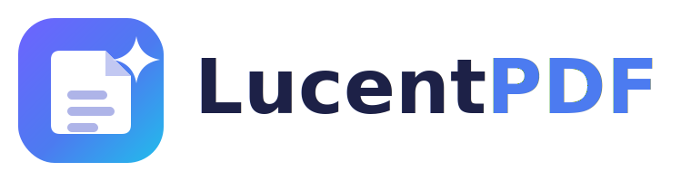

<p align="center">
  
</p>

<p align="center">
  Aplicación nativa de macOS que combina lotes de PDF escaneados en un único
  documento con texto buscable, mediante OCR de alta calidad.
</p>

---

## Qué hace

LucentPDF permite a cualquier usuario, **sin tocar una terminal**:

1. Elegir una carpeta raíz.
2. Buscar automáticamente todos los PDF dentro de ella y de sus subcarpetas.
3. Ver cuántos PDF hay, sus rutas, el peso total y las páginas estimadas.
4. Aplicar **OCR de alta calidad** (Apple Vision, con Tesseract como respaldo).
5. Combinar todo en un **único PDF con texto buscable y seleccionable**.
6. Elegir dónde guardar el documento final.
7. Revisar un informe de resultados con las incidencias por archivo.

Todo desde una interfaz gráfica moderna, con soporte de modo claro/oscuro,
arrastrar y soltar, progreso en vivo y cancelación.

## Cómo conseguir la app

No hace falta compilar nada a mano. Ver **[docs/DISTRIBUCION.md](docs/DISTRIBUCION.md)**:

- **Opción A:** lanzar el workflow de GitHub Actions y descargar el `.dmg` ya
  hecho (los Mac de GitHub compilan por ti, gratis).
- **Opción B:** compilar en tu propio Mac con los scripts incluidos.

Instalación: abrir el `.dmg` y arrastrar **LucentPDF** a Aplicaciones.

> El build de coste cero no está notarizado: en la **primera** apertura, hacer
> clic derecho sobre la app → **Abrir**. Cómo añadir notarización: ver la guía
> de distribución.

## Requisitos

- macOS 13 Ventura o posterior.
- Apple Silicon (recomendado) o Intel. El motor de respaldo Tesseract solo se
  incluye para Apple Silicon; en Intel se usa Apple Vision (igualmente nativo).

## Estructura del proyecto

```
LucentPDF/
├─ project.yml                  Definición del proyecto (XcodeGen)
├─ LucentPDF/
│  ├─ App/                      Punto de entrada y ViewModel principal
│  ├─ Models/                   Modelos de datos y ajustes
│  ├─ Services/
│  │  ├─ FileDiscovery/         Búsqueda recursiva de PDF
│  │  ├─ OCR/                   Motores Vision/Tesseract y coordinador por capas
│  │  ├─ PDF/                   Rasterizado, detección de texto y ensamblado
│  │  ├─ Pipeline/              Orquestación del procesamiento por lotes
│  │  ├─ Export/                Guardado de resultados y reportes
│  │  ├─ Logging/               Registro técnico exportable
│  │  └─ Updates/               Auto-actualización con Sparkle
│  ├─ Views/                    Interfaz SwiftUI
│  ├─ Utilities/                Formateadores, tema visual, utilidades de imagen
│  └─ Resources/                Info.plist, entitlements, assets, iconos
├─ LucentPDFTests/              Pruebas automáticas
├─ scripts/                     Generación de assets, empaquetado, DMG
├─ docs/                        Documentación y branding
└─ .github/workflows/           CI: compilación y creación del DMG
```

## Desarrollo

```bash
./scripts/dev_setup.sh      # instala XcodeGen, genera y abre el proyecto
```

El branding (logo, iconos) se regenera con:

```bash
pip install cairosvg pillow
python3 scripts/generate_assets.py
```

## Documentación

- **[Decisiones técnicas](docs/DECISIONES-TECNICAS.md)** — stack, motor OCR,
  estrategia de lotes, combinación, actualizaciones y limitaciones.
- **[Distribución](docs/DISTRIBUCION.md)** — compilar, firmar, notarizar,
  publicar versiones y configurar Sparkle.

## Licencia

© 2026 LucentPDF. Todos los derechos reservados.
